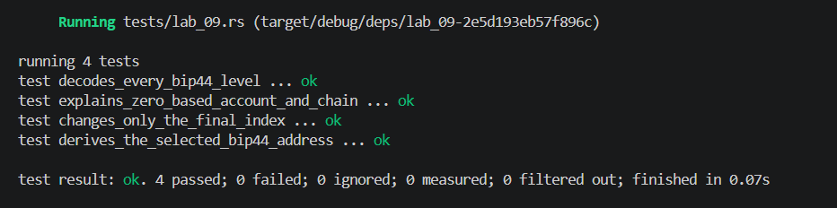

## Commands used

```bash
cargo test --test lab_09
cargo fmt --check
cargo clippy -- -D warnings
```

## Terminal output

```
running 4 tests
test decodes_every_bip44_level ... ok
test explains_zero_based_account_and_chain ... ok
test changes_only_the_final_index ... ok
test derives_the_selected_bip44_address ... ok

test result: ok. 4 passed; 0 failed; 0 ignored; 0 measured; 0 filtered out; finished in 0.00s
```

## Evidence references



## Explanation
BIP 44 uses a five-level path `m / purpose' / coin_type' / account' / change / address_index` where account and address_index are zero-based. The apostrophe denotes hardened derivation (index ≥ 2³¹), applied to the first three levels to isolate account hierarchies—compromising one account's xpub cannot reveal siblings or the parent key. The fourth level is the change branch: index 0 is the receive (external) chain for publicly shared addresses, while index 1 is the change (internal) chain for return addresses. The fifth level increments to generate fresh addresses without reusing any. Together, this structure gives every wallet a deterministic, auditable tree of addresses with clear semantic separation between accounts, chains, and individual slots.
