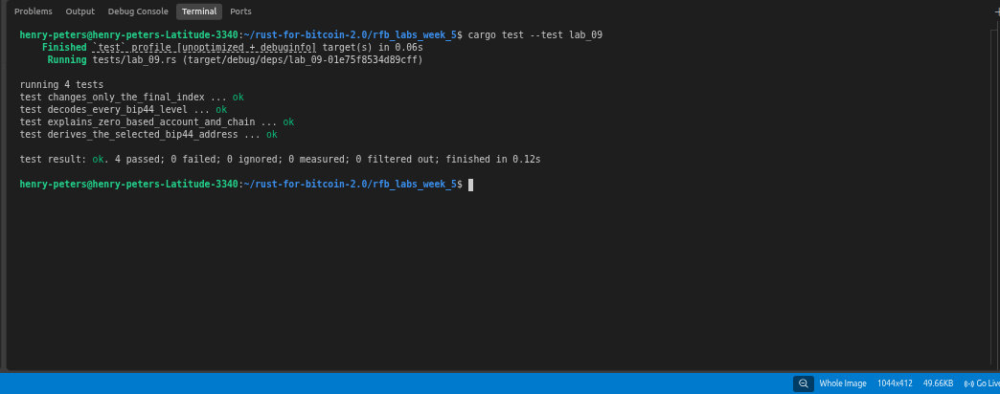

# Lab 09 — BIP44 path decoding

## Commands used

```bash
cargo test --test lab_09
```

## Terminal output

```bash
running 4 tests
test changes_only_the_final_index ... ok
test decodes_every_bip44_level ... ok
test explains_zero_based_account_and_chain ... ok
test derives_the_selected_bip44_address ... ok

test result: ok. 4 passed; 0 failed; 0 ignored; 0 measured; 0 filtered out; finished in 0.12s
```

## Evidence references



## Explanation

A BIP44 path has five levels: `m / purpose' / coin_type' / account' / change / index`

**Purpose (44'):** Hardened. Identifies the derivation standard in use — 44 for BIP44 (P2PKH), 49 for BIP49 (P2SH-P2WPKH), 84 for BIP84 (P2WPKH). The apostrophe means hardened derivation.

**Coin type (0' or 1'):** Hardened. Identifies the cryptocurrency and network — 0 is Bitcoin mainnet, 1 is Bitcoin testnet/regtest. Defined in SLIP44.

**Account (n'):** Hardened. Zero-based — account 0 is the first account, account 2 is the third account. Hardened so that leaking one account's xpub cannot affect other accounts.

**Change (0 or 1):** Normal (not hardened). 0 is the external/receive chain (addresses you share with others), 1 is the internal/change chain (addresses your wallet uses for transaction change outputs).

**Index (n):** Normal. Zero-based — index 0 is the first address, index 5 is the sixth address. Wallets increment this for each new address to avoid reuse.

For `m/44'/0'/2'/1/5`: purpose 44, Bitcoin mainnet, third account, change chain, sixth address.
