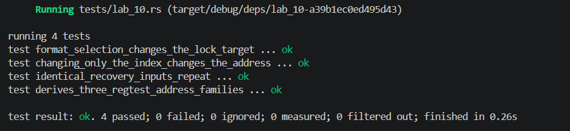

## Commands used

```bash
cargo test --test lab_10
cargo fmt --check
cargo clippy -- -D warnings
```

## Terminal output

```
running 4 tests
test derives_three_regtest_address_families ... ok
test identical_recovery_inputs_repeat ... ok
test changing_only_the_index_changes_the_address ... ok
test format_selection_changes_the_lock_target ... ok

test result: ok. 4 passed; 0 failed; 0 ignored; 0 measured; 0 filtered out; finished in 0.00s
```

## Evidence references



## Explanation
Identical recovery inputs—same mnemonic, same passphrase, same derivation path, and same address format—deterministically reproduce the same extended keys and therefore the same addresses. This determinism is what makes wallet recovery possible: anyone with the seed words can rebuild the entire address tree. However, restoring a wallet also depends on knowing the path convention (e.g., BIP 44, BIP 49, BIP 84) and the script format (P2PKH, P2SH-P2WPKH, P2WPKH), because the same master key can derive different addresses under different schemes. Format selection changes the lock target—P2PKH, P2SH, and native witness scripts each produce distinct address encodings—even though all are derived from the same underlying key material.
