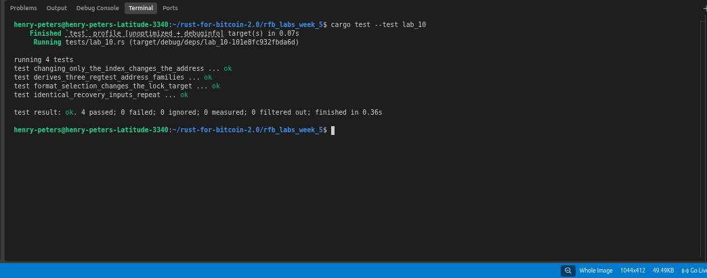

# Lab 10 — Deterministic recovery across address families

## Commands used

```bash
cargo test --test lab_10
```

## Terminal output

```bash
running 4 tests
test changing_only_the_index_changes_the_address ... ok
test derives_three_regtest_address_families ... ok
test format_selection_changes_the_lock_target ... ok
test identical_recovery_inputs_repeat ... ok

test result: ok. 4 passed; 0 failed; 0 ignored; 0 measured; 0 filtered out; finished in 0.34s
```

## Evidence references



## Explanation

**Why identical inputs reproduce the same address:**
BIP39 and BIP32 are fully deterministic. Given the same mnemonic, passphrase, derivation path, and address format, every step of the derivation — PBKDF2 seed stretch, master key creation, child key derivation, and address encoding — produces identical bytes. There is no randomness involved after the initial entropy was generated. This is how wallet recovery works: the same inputs always rebuild the same tree.

**Why restoring a wallet also depends on path and script conventions:**
The mnemonic alone is not enough to recover a wallet. You also need to know which derivation paths were used (BIP44, BIP49, or BIP84) and which address format was applied at the leaf (P2PKH, P2SH-P2WPKH, or P2WPKH). The same leaf private key encoded as P2PKH and P2WPKH produces two different addresses with different locking scripts. A wallet that scans only BIP84 paths will miss funds sent to BIP44 addresses, even from the same mnemonic. This is why most wallet recovery flows ask users to specify or scan multiple path/format combinations.

**Regtest address prefixes:**
- BIP44 P2PKH: starts with `m` or `n`
- BIP49 P2SH-P2WPKH: starts with `2`
- BIP84 P2WPKH: starts with `bcrt1q`
